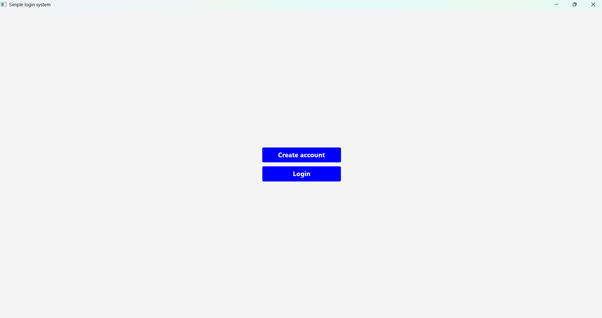
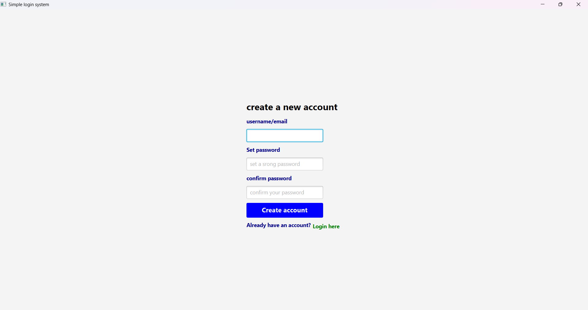
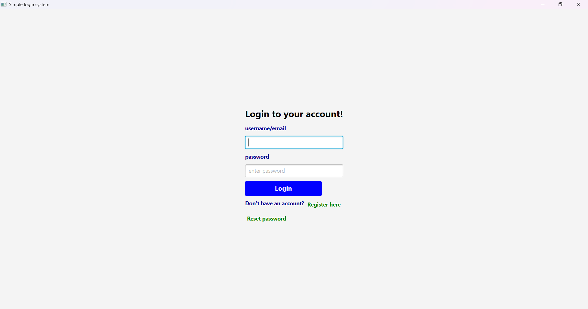
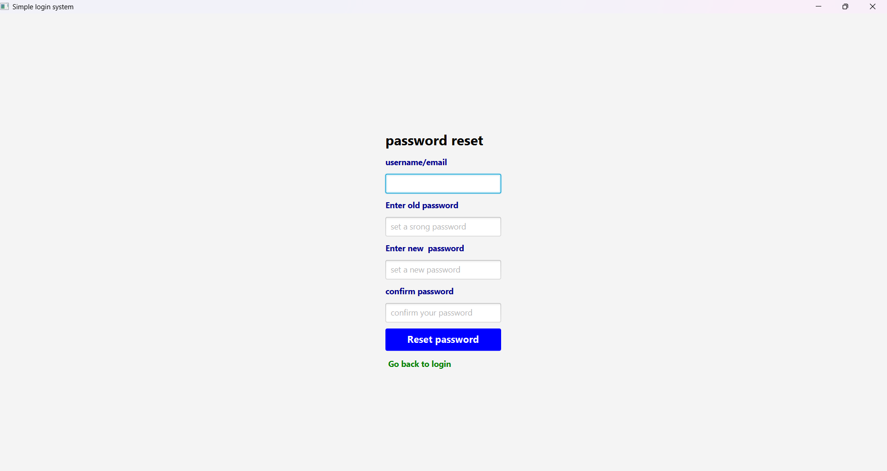
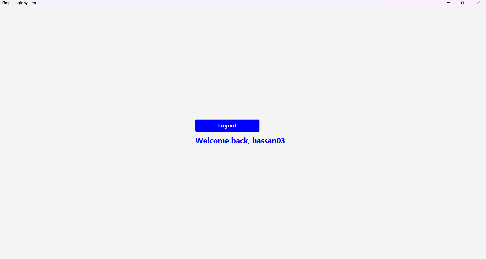

# JavaFX Login System 

A simple **JavaFX Login System** that allows users to create accounts, log in, and reset passwords.
This project demonstrates authentication logic, UI design using JavaFX, and user validation using a HashMap.
I will advance it using Database in the future.

# Features

1. Create Account
2. Login 
3. Password Reset
4. Logout Functionality
5. Input Validation
6. Password Confirmation
7. Notification Messages
8. Hover Effects on Buttons
9. Multi-Screen Navigation
10. Temporary User Storage using HashMap

# Technologies Used

* Java 
* JavaFX 
* HashMap (User Storage) - temporary before advancing to Databases
* GridPane Layout
* HBox Layout
* Event Handling
* PauseTransition (for notifications)

#  SCREENSHOTS

## Main Menu

## Create Account Screen

## Login Screen

## Password Reset Screen

## Welcome Screen

# Project Structure

JavaFX-Login-System/
│
├── src/
│   └── com/
│       └── example/
│           └── LoginSystem.java
│
├── images/
│   ├── menu.png
│   ├── create-account.png
│   ├── login.png
│   ├── reset-password.png
│   └── welcome.png
│
├── pom.xml
└── README.md

# How to Run the Project

## Requirements

Make sure you have:

* Java JDK 17 or later
* JavaFX SDK installed
* Maven installed

## Steps

1. Clone the repository:

git clone https://github.com/hassan200503/JavaFX-Login-System.git

2. Navigate into the project folder;

cd LoginSystem

3. Run the project;

mvn clean javafx:run

#  How the System Works

## Create Account

* User enters;

  * Username
  * Password
  * Confirm Password
* System checks;

  * Passwords match
  * Username is not empty
* Account is stored in a **HashMap** temporarily.

## Login

* User enters username and password
* System checks;

  * Username exists
  * Password matches
* If correct;

  * User is logged in
  * Welcome message is displayed

## Password Reset

User must provide:

* Username
* Old Password
* New Password
* Confirm Password

System checks;

* Username exists
* Old password matches
* New passwords match

If valid;

 1. Password is updated
 2. Success notification is displayed

# What I practised From This Project

* JavaFX UI Design
* Event Handling in JavaFX
* HashMap-based User Authentication
* Input Validation
* Password Reset Logic
* Navigation Between Screens
* UI Feedback using Notifications
* Hover Effects in JavaFX
* PauseTransition

# Future Improvements

* Database connection
* Add unique username validation
* Implement password hashing
* Use external CSS styling
* Add database support (MySQL)
* Improve UI styling

#  Author

**Hassan Karungwa**  

GitHub: [https://github.com/hassan200503](https://github.com/hassan200503)

NOTE;

This project is part of my **JavaFX learning**.

**GOALS**

1. Master JavaFX and Java basics very well
2. Build 50+ projects
3. Learn Databases(SQL)
4. Learn APIs
5. Learn Web development basics

Since I love coding, I will do this.

# Vision:

Become a powerful software developer and a real problem solver.
